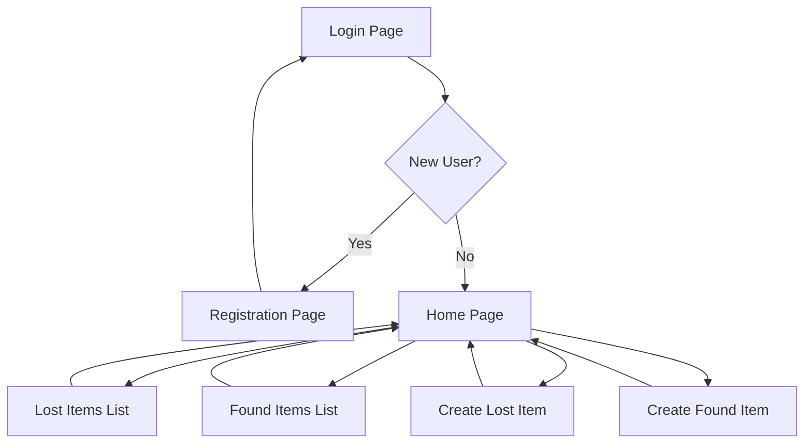

## 1. Product Overview
A simple web application for campus students to report lost items and found items, helping reunite lost belongings with their owners. Students can create listings for both lost and found items, browse existing listings, and track potential matches.

This system solves the common campus problem of lost belongings by providing a centralized platform for reporting and matching lost/found items, making it easier for students to recover their lost possessions.

## 2. Core Features

### 2.1 User Roles
| Role | Registration Method | Core Permissions |
|------|---------------------|------------------|
| Student | Email registration | Create lost/found listings, browse all listings, view own listings |

### 2.2 Feature Module
The Campus Lost & Found System consists of the following main pages:
1. **Login page**: User authentication, registration link.
2. **Registration page**: New user account creation.
3. **Home page**: Navigation menu, quick access to lost/found sections.
4. **Lost items list**: Browse all reported lost items with search/filter.
5. **Create lost item**: Form to report a lost item with details.
6. **Found items list**: Browse all found items showing matchedLostItemId when available.
7. **Create found item**: Form to report a found item with details.

### 2.3 Page Details
| Page Name | Module Name | Feature description |
|-----------|-------------|---------------------|
| Login page | Authentication form | Allow users to login with email and password, include link to registration page, validate input fields, display error messages for invalid credentials. |
| Registration page | Registration form | Create new account with email, password, and name fields, validate all inputs, show success/error messages, redirect to login after successful registration. |
| Home page | Navigation menu | Display links to all main sections (Lost Items, Found Items, Create Lost, Create Found), show user authentication status, provide logout functionality. |
| Lost items list | Item listings | Display all lost items in card/grid format, show item details (name, description, location, date), include search/filter functionality, link to individual item details. |
| Create lost item | Item form | Form with fields for item name, description, lost location, lost date, contact info, image upload option, validate all required fields, submit to backend API. |
| Found items list | Item listings | Display all found items with matchedLostItemId shown when available, show item details and match status, include search/filter functionality. |
| Create found item | Item form | Form with fields for item name, description, found location, found date, contact info, image upload option, validate all required fields, submit to backend API. |

## 3. Core Process
**Student User Flow:**
1. User accesses the application and sees the login page
2. New users register with email, password, and name
3. Existing users login with credentials
4. After authentication, user sees the home page with navigation options
5. User can browse existing lost items or found items
6. User can create new lost item reports or found item reports
7. When viewing found items, matchedLostItemId is displayed if available
8. User can logout from any page

## 4. User Interface Design

### 4.1 Design Style
- **Primary colors**: Blue (#2563eb) for headers and buttons, White (#ffffff) for backgrounds
- **Secondary colors**: Light gray (#f3f4f6) for cards, Green (#10b981) for success states, Red (#ef4444) for errors
- **Button style**: Rounded corners (8px radius), medium size, hover effects
- **Font**: System fonts (Inter, sans-serif), 16px base size, 14px for secondary text
- **Layout style**: Card-based layout with top navigation bar, responsive grid for item listings
- **Icons**: Simple line icons for navigation and actions

### 4.2 Page Design Overview
| Page Name | Module Name | UI Elements |
|-----------|-------------|-------------|
| Login page | Authentication form | Centered card layout, input fields with labels, primary blue login button, link to registration in muted gray, error message in red text below form. |
| Registration page | Registration form | Similar to login but with additional name field, success message in green, redirect timer countdown. |
| Home page | Navigation menu | Top navigation bar with logo and menu items, welcome message with user name, grid of action cards for main functions, logout button in top-right. |
| Lost items list | Item listings | Responsive card grid (3 columns desktop, 1 mobile), each card shows item image placeholder, name, location, date in muted text, hover shadow effect. |
| Create lost item | Item form | Single column form with labeled inputs, required field indicators, submit button at bottom, cancel button to return home, form validation messages. |
| Found items list | Item listings | Similar to lost items but includes matchedLostItemId badge in green when present, shows match status prominently. |
| Create found item | Item form | Same layout as create lost item form but with "found" specific labels and fields. |

### 4.3 Responsiveness
Desktop-first design approach with mobile responsiveness. Navigation collapses to hamburger menu on mobile, card grids adjust from 3 columns to 1 column, forms remain single column but with larger touch targets (minimum 44px height for inputs and buttons).