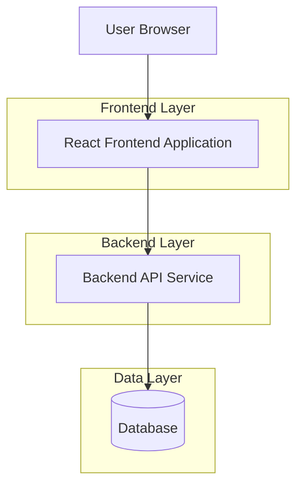
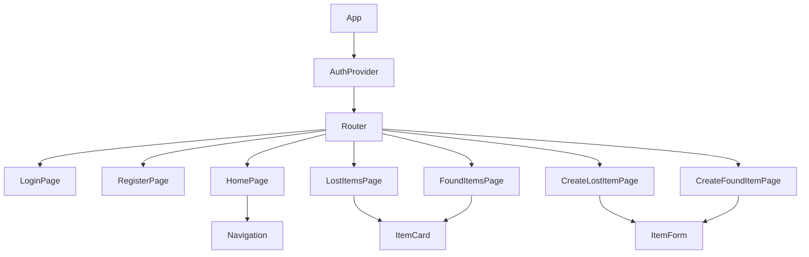

## 1. Architecture design



## 2. Technology Description

* Frontend: React\@18 + tailwindcss\@3 + vite

* Initialization Tool: vite-init

* Backend: External API service at <http://localhost:3000>

* HTTP Client: axios (preferred) or fetch API

* State Management: React Context API for authentication state

* Routing: React Router v6

## 3. Route definitions

| Route         | Purpose                                                       |
| ------------- | ------------------------------------------------------------- |
| /             | Login page, user authentication entry point                   |
| /register     | Registration page for new user accounts                       |
| /home         | Home page with navigation and main dashboard                  |
| /lost-items   | List all reported lost items with search/filter               |
| /create-lost  | Form to report a new lost item                                |
| /found-items  | List all found items showing matchedLostItemId when available |
| /create-found | Form to report a new found item                               |

## 4. API definitions

### 4.1 Authentication APIs

**User Registration**

```
POST http://localhost:3000/api/auth/register
```

Request:

| Param Name | Param Type | isRequired | Description        |
| ---------- | ---------- | ---------- | ------------------ |
| email      | string     | true       | User email address |
| password   | string     | true       | User password      |
| name       | string     | true       | User full name     |

Response:

| Param Name | Param Type | Description                 |
| ---------- | ---------- | --------------------------- |
| success    | boolean    | Registration status         |
| message    | string     | Status message              |
| userId     | string     | New user ID (if successful) |

**User Login**

```
POST http://localhost:3000/api/auth/login
```

Request:

| Param Name | Param Type | isRequired | Description        |
| ---------- | ---------- | ---------- | ------------------ |
| email      | string     | true       | User email address |
| password   | string     | true       | User password      |

Response:

| Param Name | Param Type | Description                    |
| ---------- | ---------- | ------------------------------ |
| success    | boolean    | Login status                   |
| token      | string     | JWT authentication token       |
| user       | object     | User details (id, email, name) |

### 4.2 Lost Items APIs

**Get All Lost Items**

```
GET http://localhost:3000/api/lost-items
```

Headers: `Authorization: Bearer {token}`

Response:

| Param Name | Param Type | Description                |
| ---------- | ---------- | -------------------------- |
| items      | array      | Array of lost item objects |

**Create Lost Item**

```
POST http://localhost:3000/api/lost-items
```

Headers: `Authorization: Bearer {token}`

Request:

| Param Name  | Param Type | isRequired | Description                  |
| ----------- | ---------- | ---------- | ---------------------------- |
| name        | string     | true       | Item name                    |
| description | string     | true       | Item description             |
| location    | string     | true       | Location where item was lost |
| lostDate    | string     | true       | Date when item was lost      |
| contactInfo | string     | true       | Contact information          |
| imageUrl    | string     | false      | Optional image URL           |

### 4.3 Found Items APIs

**Get All Found Items**

```
GET http://localhost:3000/api/found-items
```

Headers: `Authorization: Bearer {token}`

Response:

| Param Name | Param Type | Description                                                       |
| ---------- | ---------- | ----------------------------------------------------------------- |
| items      | array      | Array of found item objects with matchedLostItemId when available |

**Create Found Item**

```
POST http://localhost:3000/api/found-items
```

Headers: `Authorization: Bearer {token}`

Request:

| Param Name  | Param Type | isRequired | Description                   |
| ----------- | ---------- | ---------- | ----------------------------- |
| name        | string     | true       | Found item name               |
| description | string     | true       | Item description              |
| location    | string     | true       | Location where item was found |
| foundDate   | string     | true       | Date when item was found      |
| contactInfo | string     | true       | Contact information           |
| imageUrl    | string     | false      | Optional image URL            |

## 5. Frontend Component Structure



## 6. State Management

### 6.1 Authentication State

```typescript
interface AuthState {
  user: {
    id: string;
    email: string;
    name: string;
  } | null;
  token: string | null;
  isAuthenticated: boolean;
  isLoading: boolean;
}
```

### 6.2 Item Interfaces

```typescript
interface LostItem {
  id: string;
  name: string;
  description: string;
  location: string;
  lostDate: string;
  contactInfo: string;
  imageUrl?: string;
  userId: string;
  createdAt: string;
}

interface FoundItem {
  id: string;
  name: string;
  description: string;
  location: string;
  foundDate: string;
  contactInfo: string;
  imageUrl?: string;
  userId: string;
  matchedLostItemId?: string;
  createdAt: string;
}
```

## 7. Error Handling

* Network errors: Display user-friendly error messages with retry options

* Authentication errors: Redirect to login page with error message

* Validation errors: Show inline field validation messages

* API errors: Display toast notifications with error details

* Loading states: Show loading spinners during API calls

## 8. Security Considerations

* Store JWT tokens in secure HTTP-only cookies or localStorage with proper expiration

* Implement request interceptors to add authentication headers

* Validate all form inputs on client-side before submission

* Sanitize displayed content to prevent XSS attacks

* Use HTTPS for all API communications (development uses <http://localhost:3000>)

